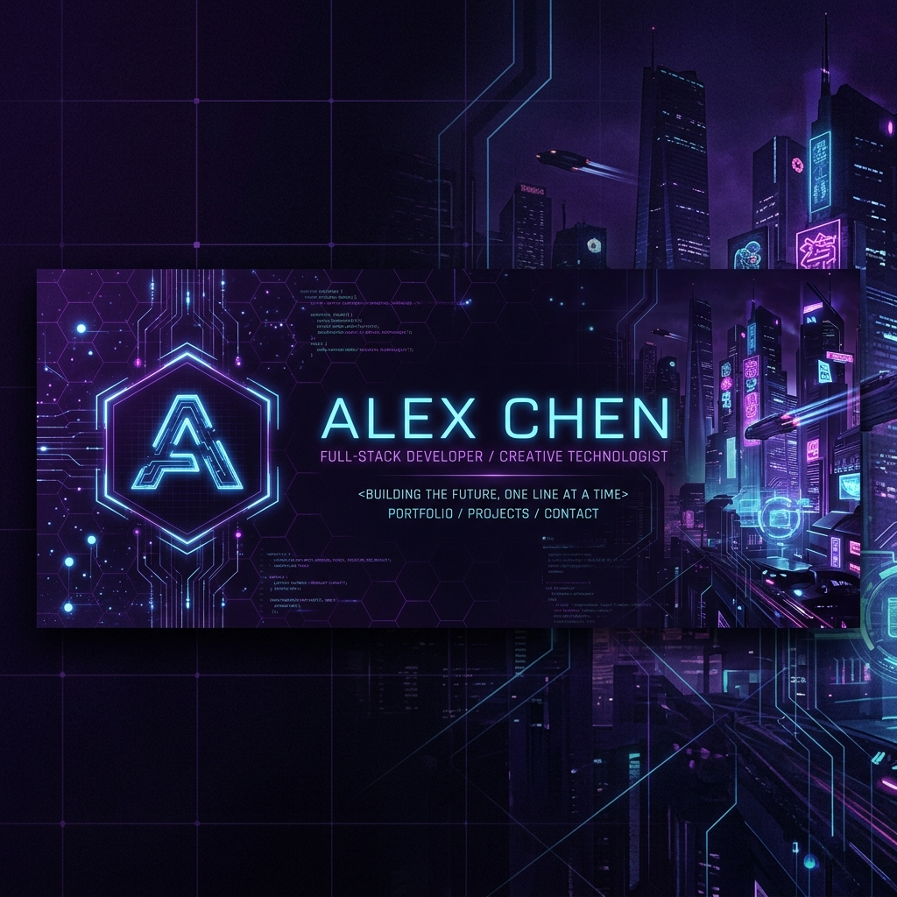

  

  # ⚡ SHAIK IRFAN BASHA ⚡
  ### AI Developer • Full-Stack Builder • Hackathon Competitor

  
  
  

  ---

  *Building the next generation of AI systems with intentional design and premium performance.*

## 🚀 About Me
I am a 19-year-old developer from Hyderabad, pursuing a BTech in Computer Science at **NIAT × Aurora Deemed University**. I specialize in building **AI-powered tools**, **autonomous pipelines**, and **high-performance web applications**. I treat every project like a product, focusing on both technical excellence and visual impact.

- 🤖 Currently deep in: **Multi-agent LLM systems** & **Computer Vision**.
- 🏆 Hackathon-driven strategy: Building production-ready solutions under pressure.
- 🎨 Design Philosophy: **Minimalist, Confident, Dark-themed.**

---

## 🛠️ Tech Stack

| **Languages** | **Frameworks** | **AI / ML** | **Infrastructure** |
| :--- | :--- | :--- | :--- |
|  |  |  |  |
|  |  |  |  |
|  |  |  |  |

---

## 🌟 Featured Projects

### 🧠 [RootSight](https://github.com/IrfanCodesBTW/RootSight)
> **AI-powered incident responder.**
Automates cognitive tasks for engineers by reconstructing timelines and generating root-cause hypotheses in under 3 minutes.
`Python` • `Next.js` • `LLM Agents`

### 📉 [DecisionEngine](https://github.com/IrfanCodesBTW/DecisionEngine)
> **Local-first performance analytics.**
Transforms feedback transcripts into structured insights using local LLMs via Ollama. 100% privacy-focused.
`Python` • `Ollama` • `FastAPI`

### 🚂 [RailCascade](https://github.com/IrfanCodesBTW/RailCascade)
> **Railway RL Environment.**
Deterministic simulation for modeling traffic management and cascading delays. Scored **93/100** at OpenEnv Hackathon.
`Python` • `Docker` • `OpenEnv`

### 👁️ [FocusSense AI](https://github.com/IrfanCodesBTW/FocusSenseAI)
> **Real-time Focus & Emotion Tracker.**
Webcam-based dashboard for visualizing productivity trends and emotional distribution.
`OpenCV` • `DeepFace` • `Pandas`

---

## 📈 GitHub Stats

  
  

---

  <h3>Let's collaborate!</h3>
  
Find more of my work at <a href="https://github.com/IrfanCodesBTW">IrfanCodesBTW</a>

